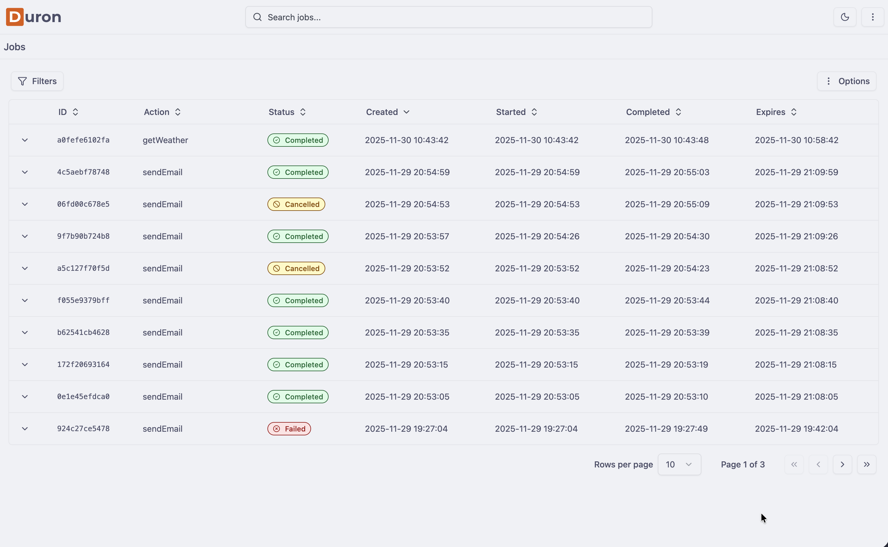
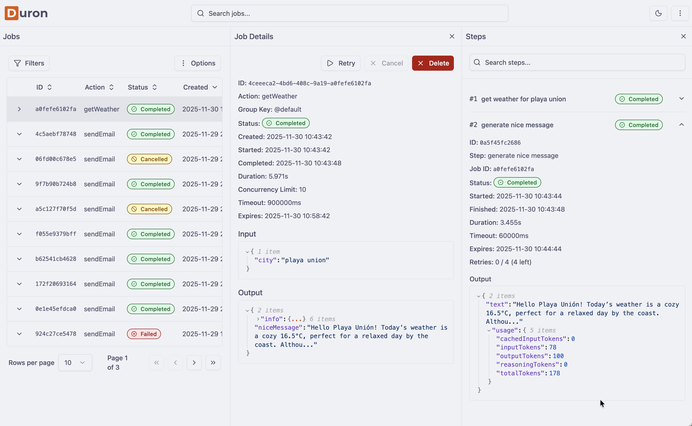

<div align="center">
  
  <p><strong>A powerful, type-safe job queue system for Node.js and Bun</strong></p>
</div>

---

Duron is a modern, type-safe background job processing system built with TypeScript. It provides a robust foundation for executing asynchronous tasks with built-in retry logic, concurrency control, step-based execution, and comprehensive observability.

## 📚 Documentation

📖 **[View Full Documentation →](https://duron-docs.pages.dev/)**

The complete documentation includes detailed guides on actions, adapters, client API, server API, error handling, retries, and more.

## ✨ Features

- **Type-Safe Actions** - Define actions with Zod schemas for input/output validation
- **Step-Based Execution** - Break down complex workflows into manageable, retryable steps
- **Intelligent Retry Logic** - Configurable exponential backoff with per-action and per-step options
- **Flexible Sync Patterns** - Pull, push, hybrid, or manual job fetching
- **Advanced Concurrency Control** - Per-action, per-group, and dynamic concurrency limits
- **Reliability & Recovery** - Automatic job recovery, multi-process coordination, and stuck job detection
- **Database Adapters** - PostgreSQL (production) and PGLite (development/testing)
- **REST API Server** - Built-in Elysia-based API with advanced filtering and pagination
- **Dashboard UI** - Beautiful React dashboard for real-time job monitoring

## 📊 Dashboard Preview

<div align="center">
  <h3>Job List View</h3>
  

  <h3>Job Details - Completed</h3>
  
</div>

## 🚀 Quick Start

### Installation

```bash
bun add duron postgres drizzle-orm@beta
# or
npm install duron postgres drizzle-orm@beta
# or
pnpm add duron postgres drizzle-orm@beta
# or
yarn add duron postgres drizzle-orm@beta
```

### Creating an Action with Context

Actions are defined with Zod schemas and have access to a context object that includes input, variables, and a step function. First define your variables type, then use `defineAction` with the variables type as a generic parameter:

```typescript
import { defineAction } from 'duron'
import { z } from 'zod'

// Define your variables type
const variables = {
  apiKey: process.env.EMAIL_API_KEY,
}

// Define the action with variables type as generic
const sendEmail = defineAction<typeof variables>()({
  name: 'send-email',
  input: z.object({
    email: z.string().email(),
    subject: z.string(),
    body: z.string(),
  }),
  output: z.object({
    success: z.boolean(),
  }),
  handler: async (ctx) => {
    // Access input data
    const { email, subject, body } = ctx.input

    // Access shared variables (type-safe!)
    const apiKey = ctx.var.apiKey

    // Execute steps with retry logic
    // Steps are retryable units of work that can be monitored and cancelled
    const result = await ctx.step('send-email', async ({ signal }) => {
      // Your email sending logic here
      // The signal can be used to handle cancellation
      const response = await fetch('https://api.email.com/send', {
        method: 'POST',
        headers: {
          'Content-Type': 'application/json',
          'Authorization': `Bearer ${apiKey}`,
        },
        body: JSON.stringify({ email, subject, body }),
        signal, // Pass signal to enable cancellation
      })

      if (!response.ok) {
        throw new Error('Failed to send email')
      }

      return await response.json()
    })

    return { success: result.success ?? true }
  },
})
```

### Creating a Client with PostgreSQL

```typescript
import { duron } from 'duron'
import { postgresAdapter } from 'duron/adapters/postgres'

// Define variables (same type used in defineAction)
const variables = {
  apiKey: process.env.EMAIL_API_KEY,
}

const client = duron({
  id: 'my-app',
  database: postgresAdapter({
    connection: process.env.DATABASE_URL, // PostgreSQL connection string
  }),
  actions: {
    sendEmail,
  },
  variables, // Pass the variables object
  logger: 'info',
})

await client.start()

// Run an action
const jobId = await client.runAction('sendEmail', {
  email: 'user@example.com',
  subject: 'Hello',
  body: 'Welcome!',
})
```

### Starting a Server with Dashboard

The server includes authentication and can serve the dashboard as standalone HTML:

```typescript
import { createServer } from 'duron/server'
import { getHTML } from 'duron-dashboard/get-html'
import { Elysia } from 'elysia'

// Define variables (same type used in defineAction)
const variables = {
  apiKey: process.env.EMAIL_API_KEY,
}

// Create the Duron client
const client = duron({
  database: postgresAdapter({
    connection: process.env.DATABASE_URL,
  }),
  actions: {
    sendEmail,
  },
  variables, // Pass the variables object
})

// Create the API server with authentication
const app = createServer({
  client,
  prefix: '/api',
  login: {
    onLogin: async ({ email, password }) => {
      // Implement your authentication logic
      // Return true if credentials are valid
      // In production, validate against your user database
      return email === 'admin@example.com' && password === 'secure-password'
    },
    jwtSecret: process.env.JWT_SECRET || 'your-secret-key',
    expirationTime: '24h', // Optional, defaults to '1h'
    refreshTokenExpirationTime: '7d', // Optional, defaults to '7d'
  },
})

// Serve the dashboard
app.get('/', async () => {
  const html = await getHTML({ url: 'http://localhost:3000/api' })
  return new Response(html, {
    headers: { 'Content-Type': 'text/html' },
  })
})

// Start the server
app.listen(3000)
```

#### Dashboard Authentication Setup

The dashboard requires authentication to access. Here's how to set it up:

1. **Configure Login Handler**: The `onLogin` function in the server configuration is called when users attempt to log in. You should implement your own authentication logic here:

```typescript
login: {
  onLogin: async ({ email, password }) => {
    // Example: Validate against a database
    const user = await db.users.findByEmail(email)
    if (!user) return false

    // Verify password (use bcrypt, argon2, etc. in production)
    const isValid = await verifyPassword(password, user.hashedPassword)
    return isValid
  },
  jwtSecret: process.env.JWT_SECRET || 'your-secret-key', // Use a strong secret in production
  expirationTime: '24h', // Access token expiration
  refreshTokenExpirationTime: '7d', // Refresh token expiration
}
```

2. **Access the Dashboard**: Navigate to `http://localhost:3000/` in your browser.

3. **Login**: Use the credentials that your `onLogin` function validates. For the example above, use:
   - Email: `admin@example.com`
   - Password: `secure-password`

4. **Security Notes**:
   - Always use a strong, randomly generated `JWT_SECRET` in production
   - Store secrets in environment variables, never in code
   - Implement proper password hashing (bcrypt, argon2, etc.)
   - Consider rate limiting for login attempts
   - Use HTTPS in production

The dashboard will automatically handle token refresh and maintain your session.

## 🤝 Contributing

Contributions are welcome! Please feel free to submit a Pull Request.

## 📄 License

MIT

---

<div align="center">
  <p>Built with ❤️ using Bun, TypeScript, Zod, and Drizzle ORM</p>
</div>
